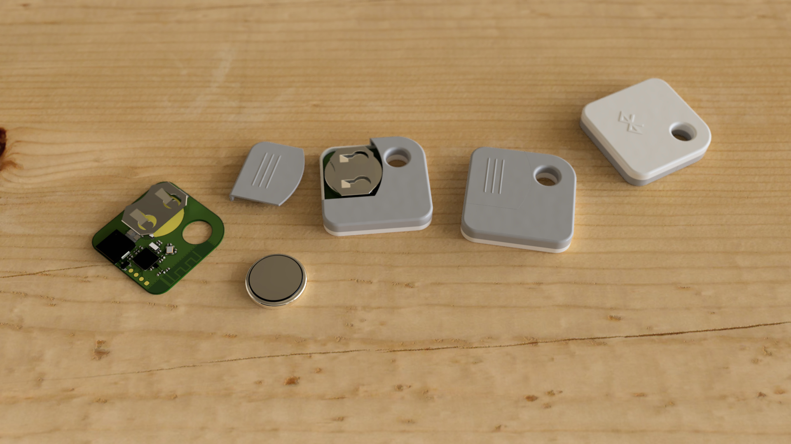
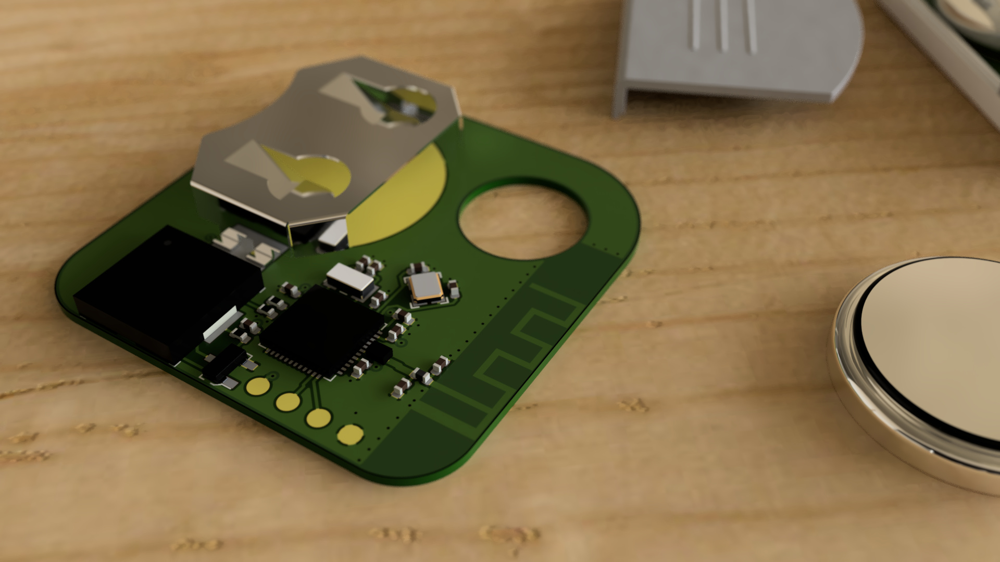
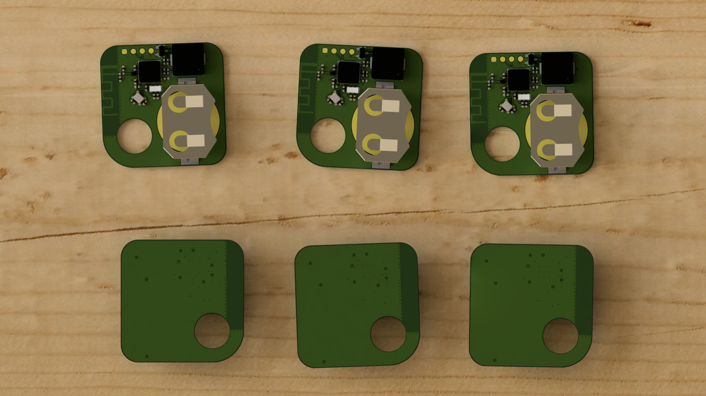
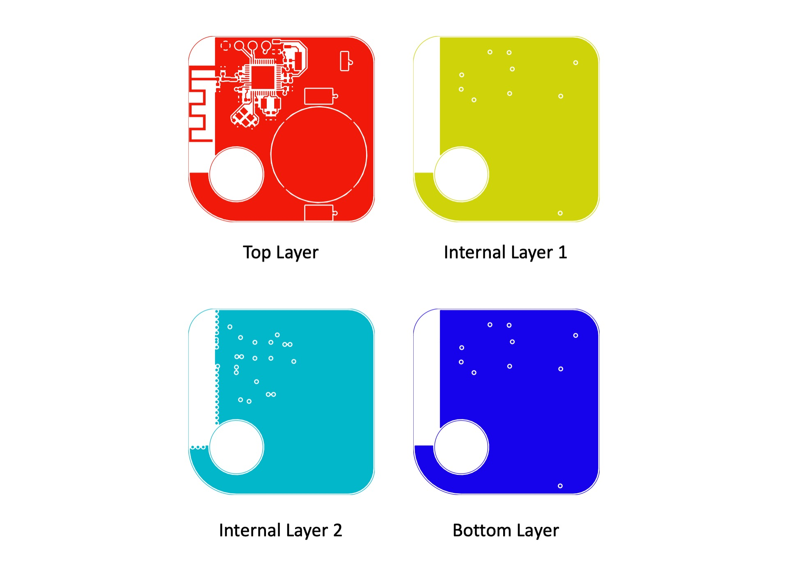

# Bluetooth Tracker

## Introduction
A Bluetooth Tracker inspired by the Tile Mate Bluetooth Tracker, built around the Nordic nRF51822 Bluetooth transceiver. The device can be programmed to pair with any Android or iOS mobile device via a mobile app.

The design of the trace antenna was provided by Texas Instrument in Application Note AN043. It is an Inverted F Antenna (IFA) with a matched 50 Ohm characteristic impendance at 2.4GHz. The device is capable of up to 4dBm of transmit power.

## Gallery

## Copper Layers

