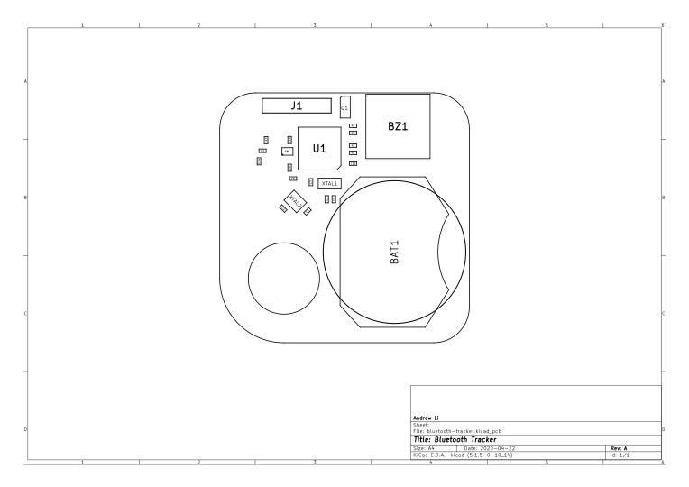

# Assembly Drawing

# Bill of Materials
| Reference  	|  Quantity 	|  Value      	|  MPN                     	|  Manufacturer                   	|  Description                                                                	|
|------------	|-----------	|-------------	|--------------------------	|---------------------------------	|-----------------------------------------------------------------------------	|
| BAT1       	| 1         	| ~           	| BK-912                   	| MPD (Memory Protection Devices) 	| BATTERY RETAINER COIN 20MM SMD                                              	|
| BZ1        	| 1         	| ~           	| PKMCS0909E4000-R1        	| Murata                          	| AUDIO PIEZO TRANSDUCER 12.5V SMD                                            	|
| C1 C3      	| 2         	| 22pF        	| GCM1555C1H220FA16D       	| Murata                          	| CAP CER 22PF 50V C0G/NP0 0402                                               	|
| C10        	| 1         	| 47nF        	| GRM155R71H473KE14D       	| Murata                          	| CAP CER 0.047UF 50V X7R 0402                                                	|
| C13        	| 1         	| 1.0pF       	| GCM1555C1H1R0CA16J       	| Murata                          	| CAP CER 1PF 50V C0G/NP0 0402                                                	|
| C14        	| 1         	| 1.5pF       	| GCM1555C1H1R5JA16D       	| Murata                          	| CAP CER 1.5PF 50V C0G/NP0 0402                                              	|
| C15 C8 C7  	| 3         	| 100nF       	| GRM155R71E104KE14J       	| Murata                          	| CAP CER 0.1UF 25V X7R 0402                                                  	|
| C4 C2      	| 2         	| 15pF        	| GJM1555C1H150FB01D       	| Murata                          	| CAP CER 15PF 50V C0G/NP0 0402                                               	|
| C6 C5      	| 2         	| 1nF         	| GCM155R71H102KA37D       	| Murata                          	| CAP CER 1000PF 50V X7R 0402                                                 	|
| GN1        	| 1         	| BAL-NRF01D3 	| BAL-NRF01D3              	| STMicroelectronics              	| BALUN 2.4GHZ-2.54GHZ 5WFBGA                                                 	|
| L3         	| 1         	| 3.3nH       	| LQP15MN3N3W02D           	| Murata                          	| 3.3nH Unshielded Thick Film Inductor 190mA 400mOhm Max 0402   (1005 Metric) 	|
| Q1         	| 1         	| ~           	| FDV301N                  	| ON Semiconductor                	| MOSFET N-CH 25V 220MA SOT-23                                                	|
| R2         	| 1         	| 100kΩ       	| RC0402FR-07100KL         	| Yageo                           	| RES SMD 100K OHM 1% 1/16W 0402                                              	|
| R3 R1      	| 2         	| 1kΩ         	| RC0402FR-071KP           	| Yageo                           	| RES SMD 1K OHM 1% 1/16W 0402                                                	|
| U1         	| 1         	| ~           	| NRF51822-QFAA-T          	| Nordic Semiconductor ASA        	| IC RF TXRX+MCU BLUETOOTH 48VFQFN                                            	|
| XTAL1      	| 1         	| ~           	| ECS-.327-12.5-34B-TR     	| ECS Inc.                        	| CRYSTAL 32.7680KHZ 12.5PF SMD                                               	|
| XTAL2      	| 1         	| ~           	| NX2520SA-16MHZ-STD-CSW-5 	| NDK America, Inc.               	| CRYSTAL 16.0000MHZ 8PF SMD                                                  	|
